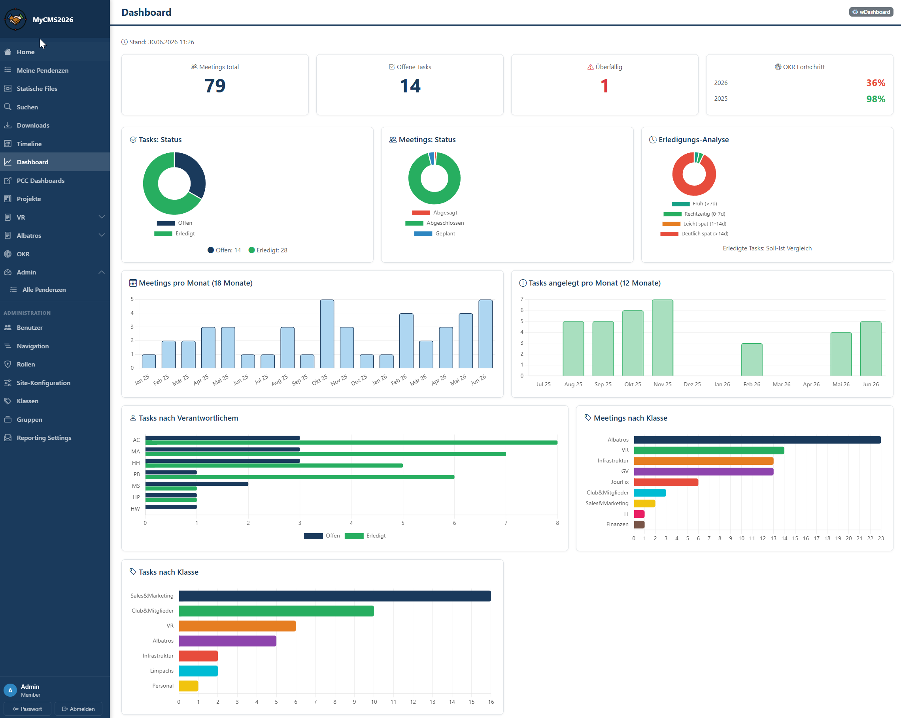

# MyCMS2026

A lightweight, file-based CMS (Collaboration and Content Management System) built on ASP.NET Core / Razor Pages. No database required — all data is stored as JSON files in `App_Data/`.
For Teams to collaborate on Projects, Tasks, Meetings, OKRs, Files.



---

## Features

- **Navigation builder** — compose pages from widgets via a drag-and-drop-style admin
- **Widgets** — Home, HTML pages, Tasks (ToDo), Meetings, Projects, OKR, Downloads, Vault, Search, Timeline
- **User management** — role-based access (Public / Member / Administrator + custom roles)
- **Image upload** — TinyMCE editor with integrated image management
- **Weekly mail / reporting** — configurable digest emails via SMTP
- **PWA ready** — installable as a progressive web app
- **IIS subdirectory support** — runs cleanly under a path prefix (e.g. `/mycms2026/`)
- **First-run setup wizard** — configure site name, admin account and optional demo data on first launch

---

## Requirements

- Windows Server with IIS (or any host supporting ASP.NET Core 8)
- .NET 8 Runtime
- Write access to the `App_Data/` directory

---

## Installation

### 1. Download

Download or clone this repository and copy the contents to your web server directory (e.g. `C:\inetpub\wwwroot\mycms2026\`).

### 2. IIS Configuration

Create a new IIS application pointing to the folder. Set the application pool to:
- **.NET CLR version:** No Managed Code
- **Managed pipeline mode:** Integrated

Ensure the application pool identity has **write access** to the `App_Data/` folder.

### 3. First Launch

Open the application in your browser. The **setup wizard** starts automatically on first launch:

1. Enter your **site name** and **base URL** (used for links in emails)
2. Create the **administrator account**
3. Optionally load **demo data** to start with a pre-configured navigation and sample content
4. Click **Complete setup** — you are redirected to the login page

### 4. Optional: SMTP Configuration

After login, go to **Admin → Site Configuration** to configure your SMTP server for email delivery.

---

## Subdirectory Deployment

If you deploy under a subdirectory (e.g. `https://example.com/mycms/`), create the folder as an **IIS Application** (not just a virtual directory). IIS will then automatically pass the path prefix to the app — no changes to `web.config` or `appsettings.json` required.

If for some reason the path prefix is not passed automatically, you can set it explicitly in `appsettings.json`:

```json
"PathBase": "/mycms"
```

---

## Directory Structure

```
App_Data/
  site.json          ← Site configuration (title, base URL, SMTP)
  navigation.json    ← Navigation structure
  users.json         ← User accounts (created by setup wizard)
  gruppen.json       ← Groups / classes
  pages/             ← HTML page content
  uploads/images/    ← Uploaded images
  demo/              ← Optional demo data (copied on setup if requested)
wwwroot/
  css/               ← Stylesheets
  js/                ← Scripts
  images/            ← App icons and static images
  manifest.json      ← PWA manifest
web.config
appsettings.json
```

`App_Data/` is not overwritten on re-deploy — your content and configuration survive updates.

---

## Updating

1. Publish a new version from Visual Studio
2. Copy all files **except `App_Data/`** to your server
3. Restart the IIS application pool

---

## License

MIT
